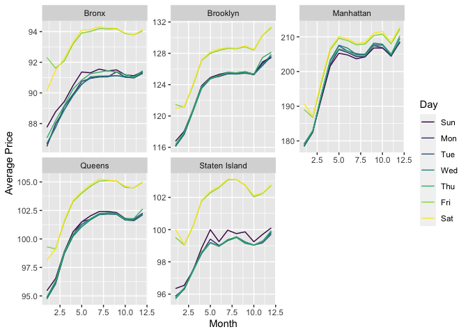
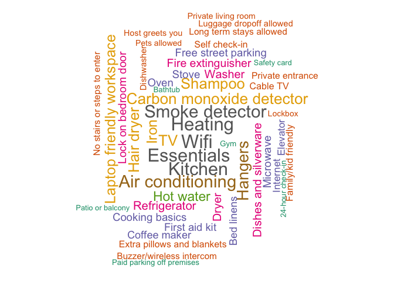
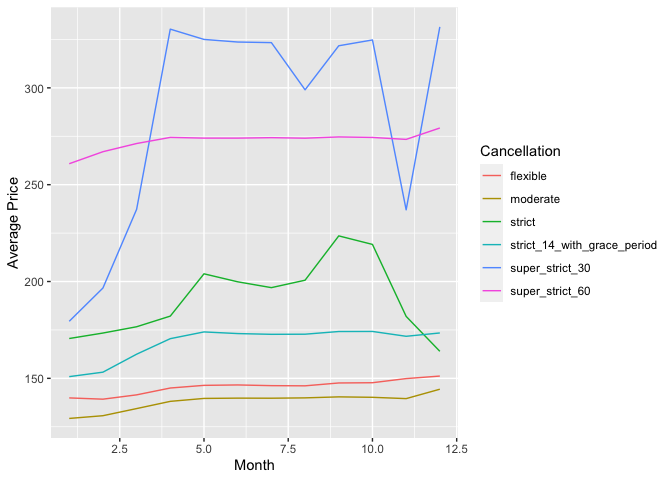
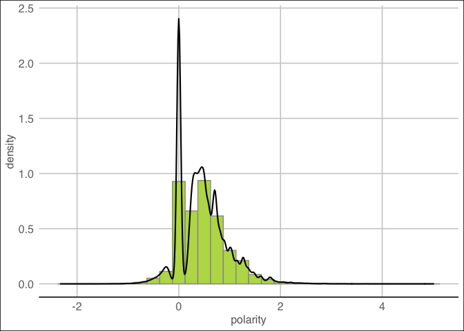
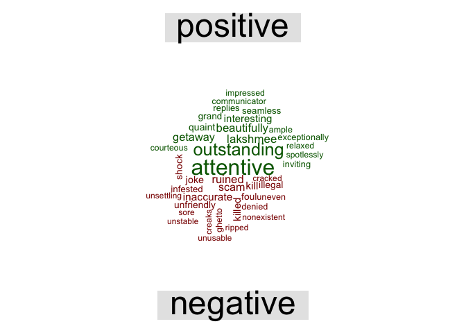
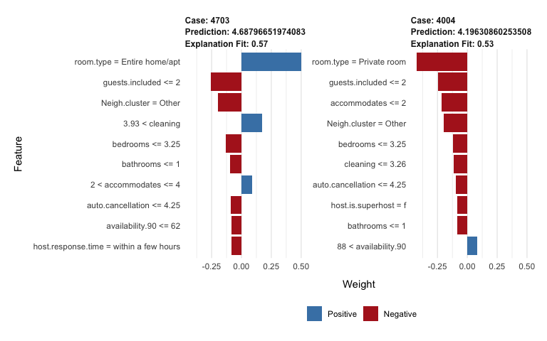
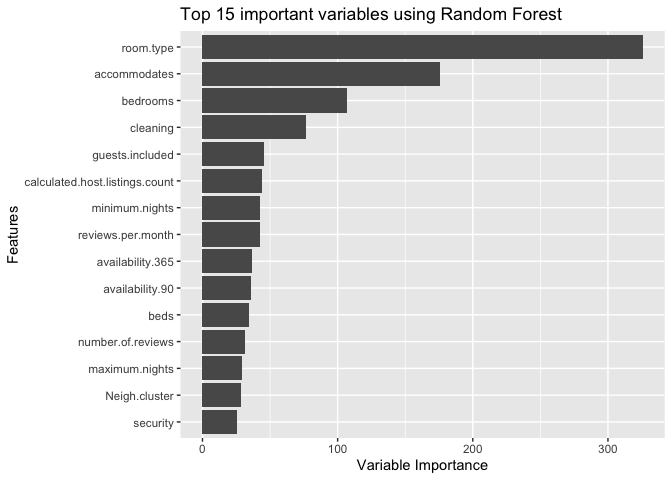
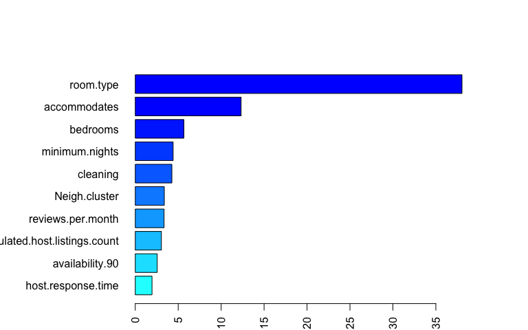

Title
================

# Executive Summary

Airbnb is a vacation rental platform formed in the year 2008. Its
business model is to build trust with unknown people, inviting guests to
stay in their (hosts’) listings. It has its presence in over 220
countries with more than 7 Million listings. The price of each listing
is determined by the host. This project uncovers the price prediction
model for Airbnb New York using various features. That dataset was
downloaded from Airbnb website and the analysis is limited to 2019
listing database dated Jan 3rd 2020. Few machine learning models and
sentiment analysis were implemented on the dataset. In conclusion,
features such as room type, property type, negative reviews, amenities,
area, superhost status and instant booking feature play a role in
impacting the price of a listing.

# 1. Introduction

The analysis was aimed at understanding the effects of different
features on price. Features include the ones available as a part of
listing as well as ones extracted from the reviews. Regression based
analysis was preferred and implemented. The analysis has 2 parts :

-   Overall listing analysis that helps understand the overall effect of
    features on price across New York.

-   Queens neighborhood analysis that includes review sentiment
    classification along with other features in the prediction model.

This would benefit :

1.  New hosts to understand how to price their listings in the near
    future and what to look for

2.  Customers to make rational choices to stay

3.  Airbnb to understand more about their listings and customer reviews

# 2. Data description

There are 3 datasets used for analysis.

1.  Overall listings dataset that contained details regarding individual
    listings in New York along along with their average price per night,
    number of beds, baths, property type, superhost status,
    neighbourhood etc. spanning 51361 observations across 106 features

2.  Review dataset that had individual customer reviews for each of the
    listings

3.  Calendar dataset that consisted of pricing details and 1 year
    availability for each of the listings

# 3. Data Pre-Processing

The listings dataset consisted of numerical fields, categorical fields,
date and text fields.

Categorical fields that had only one factor in the entire dataset were
dropped due to no variance. Numerical fields that had less than 0.2% of
NAs were dropped. Fields like cleaning fee, security deposit NAs were
replaced with 0, since those listings were not charging such fees.

Price fields like average price per night, security deposit and cleaning
fee were right skewed and thus log transformation was applied to it.

Aside, there were 220+ categories of neighborhood locations and 30+
categories of property types. These were grouped by top-n categories and
the remaining were categorized as “Others”.

Of the overall 70+ amenities offered across listings, top 20 amenities
and their presence in each of the listings were considered as factor
variables in the model.

The reviews dataset consisted of customer reviews in multiple languages.
English language ones were filtered for analysis. Also, automated
cancellation message that said “This is an automated posting” were
filtered and their count was added to the model to understand if these
affected the price.

# 4. Exploratory Data Analysis

Average price per night across different areas and days are shown below.
We can see that Manhattan is always charging a higher price followed by
Brooklyn and the others. Fridays and Saturdays are generally higher
priced than on weekdays across months.

Top 50 Amenities across listings in the New York is shown below. Wi-fi,
Heating, Kitchen, Smoke Detector, Essentials are the most common ones
followed by Air Conditioning, Hangers, Iron, Hair dyers, TV etc.

On observing the price variation with respect to cancellation policy
across months, the listings that has strict policy with 14 day grace
period show great fluctuation through out the year. Listings that have
Moderate and Flexible cancellation policy listings are, on an average,
the lowest priced.

# 5. Analysis

## A. Predicting prices using different features for the entire listings

In this model, multivariate linear regression was used to predict
log(price) taking factors such as beds, baths, property types,
amenities, cleaning fee etc. into consideration.

The results of the regression is attached in Appendix I.

    ## [1] "The Model R-Squared is = 0.6284"

    ## [1] "The Prediction(test) Mean Squared Error is = 0.1898"

Here, the error rate is measured using “Mean Squared Error”, herein
referred to as MSE.

The features that has a positive impact on price are :

-   Prices additionally charged : Cleaning fee, Security fee
-   Amenities like Hair Dryer, Fire Extinguisher, Dryer, Air
    Conditioner, TV, Carbon Monoxide detector
-   Stay type : Few Days
-   Property Type : Condominium, Service apt, Loft
-   Instant bookable, 90/365 day availability, Super Host Host years
    with Airbnb, Entire home/ apt, Presence of neighbourhood description
    in the listing among other usual variables like accommodates,
    bedrooms and bathrooms.

It is also clearly inferred that price among neighborhood groups are in
the order : Manhattan &gt; Brooklyn &gt; Queens &gt; Bronx &gt; Staten
Island

The features that has a negative impact on price are :

-   Auto cancellation
-   Stay for few weeks/months,
-   Most commonly offered amenities like Wi-Fi, Kitchen, Essentials,
    Heating
-   Cancellation policy
-   Hotel rooms and Apartment property types
-   Minimum nights required to stay

## B. Predicting the prices of Queens Neighborhood

This analysis was carried out to understand if the negative reviews had
an impact on pricing.  
Sentiment analysis using polarity scores was used to classify reviews as
positive and negative, which was then included in the model for
prediction. The Queens neighborhood locations are grouped into 3
Categories - Astoria, Long Island City and Others

The review polarity graph is shown below :

We can see from the graph that there are more number of positive reviews
than negative reviews in the Queens neighborhood indicating that
listings in Queens are performing better.

Comparison cloud of positive and negative reviews are shown below :

We can infer that negative reviews are mostly concentrated about :

1.  Cleanliness of the property - insects, stained, clogged, mouse,
    cockroach, unclean, gross, awful, blocked
2.  Host behavior - yelling, screaming, cancel, beware, upset, refused,
    warning, disappointing

These number of positive and negative reviews in each listings were
included in the model and 3 machine learning models were executed.

## 1. Linear Regression

The output of this regression is included in Appendix II

    ## [1] "The R-squared using Linear Regression is = 0.5878"

    ## [1] "The Prediction(test) MSE using Linear Regression is = 0.1634"

We can infer from the analysis that negative reviews do influence price
decrease.

## 2. Gradient Boosting Machines (GBM)

The GBM specification used after tuning the model is as follows :

    ## [1] "Optimal number of trees = 4734"

    ## [1] "Interaction depth = 3"

    ## [1] "Shrinkage = 0.01"

    ## [1] "Cross Validation Folds = 10"

<!-- -->

The above graphs show the feature importance for two random listings. We
can observe the price increase or decrease with variation in the top 10
features. These features by themselves are also able to explain 57% and
53% of variation in the prices respectively. We can also see that auto
cancellation have a negative influence on price.

For more detailed feature importance extracted with GBM, please refer
Appendix III

    ## [1] "The prediction MSE using GBM is 0.1408"

## 3. Random Forest

The random forest specification after tuning the model is shown below :

    ## [1] "Number of trees = 500"

    ## [1] "Number of variables randomly sampled as candidates at each split (mtry) = 20"

    ## [1] "Depth of the tree = 3"

The graph indicates the variable importance as observed via Random
Forest algorithm.

    ## [1] "The prediction MSE using Random Forest is 0.1424"

#### Comparison table of all three models are shown below :

    ##            Linear Model Gradient Boost Random Forest
    ## MSE values       0.1634         0.1408        0.1424

Gradient Boosting Machines and Random Forest gives low prediction MSE
and is thus a better model here.

# 6. Conclusion

From the above analysis, the following are the conclusions drawn :

1.  Prices are high during Nov-Dec - Thanksgiving and Christmas
    holidays.
2.  It is cheaper to rent listings on weekday than on a weekend.
3.  Features such as super host, amenities, neighborhood, property
    types, negative reviews, room type, listing availability, extra fees
    and others are observed to have an impact on price.
4.  Super hosts command a higher price than the usual host.
5.  Good host behavior and listing cleanliness is important to avoid
    negative reviews.

Future hosts can consider offering at least few of the top 20 amenities,
enable instant booking feature, respond quicker to guests’ requests etc.
to stand out from the other listings in New York area. This will also
aid in increasing their average price per night.

# 7. Sources

-   Datasets downloaded from <http://insideairbnb.com/get-the-data.html>
-   Sentiment Analysis in R from
    <https://learn.datacamp.com/courses/sentiment-analysis-in-r>

## Detailed output Appendix for reference

### Appendix I

Regression output

    ## 
    ## Call:
    ## lm(formula = logprice ~ ., data = train_t)
    ## 
    ## Residuals:
    ##     Min      1Q  Median      3Q     Max 
    ## -3.0817 -0.2491 -0.0258  0.2131  5.2688 
    ## 
    ## Coefficients:
    ##                                                  Estimate Std. Error t value Pr(>|t|)    
    ## (Intercept)                                     4.377e+00  3.369e-02 129.929  < 2e-16 ***
    ## host.response.timeNot Applicable               -8.887e-02  1.668e-02  -5.329 9.95e-08 ***
    ## host.response.timewithin a day                 -9.344e-02  1.751e-02  -5.336 9.53e-08 ***
    ## host.response.timewithin a few hours           -9.568e-02  1.704e-02  -5.616 1.96e-08 ***
    ## host.response.timewithin an hour               -1.112e-01  1.667e-02  -6.671 2.57e-11 ***
    ## host.is.superhostt                              4.560e-02  6.282e-03   7.259 3.96e-13 ***
    ## host.identity.verifiedt                         2.685e-04  5.030e-03   0.053 0.957430    
    ## neighbourhood.group.cleansedBrooklyn            2.694e-01  1.530e-02  17.605  < 2e-16 ***
    ## neighbourhood.group.cleansedManhattan           7.112e-01  1.621e-02  43.872  < 2e-16 ***
    ## neighbourhood.group.cleansedQueens              7.921e-02  1.570e-02   5.045 4.56e-07 ***
    ## neighbourhood.group.cleansedStaten Island      -6.244e-02  2.907e-02  -2.148 0.031726 *  
    ## is.location.exactt                             -2.199e-02  5.813e-03  -3.783 0.000155 ***
    ## room.typeHotel room                            -2.729e-01  2.746e-02  -9.937  < 2e-16 ***
    ## room.typePrivate room                          -4.739e-01  5.933e-03 -79.876  < 2e-16 ***
    ## room.typeShared room                           -8.671e-01  1.513e-02 -57.318  < 2e-16 ***
    ## accommodates                                    8.826e-02  2.124e-03  41.547  < 2e-16 ***
    ## bathrooms                                       7.928e-02  5.948e-03  13.328  < 2e-16 ***
    ## bedrooms                                        1.338e-01  5.315e-03  25.170  < 2e-16 ***
    ## beds                                           -3.237e-02  3.320e-03  -9.751  < 2e-16 ***
    ## guests.included                                 1.445e-02  2.363e-03   6.113 9.85e-10 ***
    ## minimum.nights                                 -4.048e-04  1.931e-04  -2.097 0.035999 *  
    ## maximum.nights                                 -2.588e-11  2.018e-10  -0.128 0.897913    
    ## availability.90                                 1.612e-03  9.456e-05  17.048  < 2e-16 ***
    ## availability.365                                6.856e-05  2.600e-05   2.637 0.008360 ** 
    ## number.of.reviews                              -4.420e-04  6.351e-05  -6.960 3.46e-12 ***
    ## review.scores.value                            -1.050e-02  6.459e-04 -16.254  < 2e-16 ***
    ## instant.bookablet                               1.413e-02  4.840e-03   2.919 0.003514 ** 
    ## cancellation.policymoderate                    -3.110e-02  6.340e-03  -4.905 9.38e-07 ***
    ## cancellation.policystrict                      -6.882e-02  6.959e-02  -0.989 0.322700    
    ## cancellation.policystrict_14_with_grace_period -3.132e-02  5.830e-03  -5.372 7.82e-08 ***
    ## cancellation.policysuper_strict_30             -5.366e-01  1.062e-01  -5.053 4.37e-07 ***
    ## cancellation.policysuper_strict_60              4.317e-02  4.677e-02   0.923 0.355956    
    ## require.guest.phone.verificationt               5.564e-02  1.496e-02   3.719 0.000200 ***
    ## calculated.host.listings.count                 -5.542e-04  8.889e-05  -6.235 4.56e-10 ***
    ## reviews.per.month                              -2.085e-02  2.073e-03 -10.058  < 2e-16 ***
    ## host.experience                                 9.662e-03  1.143e-03   8.452  < 2e-16 ***
    ## property.bucketCondominium                      1.373e-01  1.217e-02  11.286  < 2e-16 ***
    ## property.bucketHouse                           -9.926e-03  8.881e-03  -1.118 0.263702    
    ## property.bucketLoft                             1.553e-01  1.339e-02  11.597  < 2e-16 ***
    ## property.bucketOther                            1.654e-01  9.865e-03  16.765  < 2e-16 ***
    ## property.bucketServiced apartment               1.988e-01  2.523e-02   7.877 3.45e-15 ***
    ## Neigh.clusterBedford-Stuyvesant                -2.834e-01  1.993e-02 -14.221  < 2e-16 ***
    ## Neigh.clusterBushwick                          -3.329e-01  2.078e-02 -16.020  < 2e-16 ***
    ## Neigh.clusterChelsea                           -1.185e-01  2.365e-02  -5.013 5.39e-07 ***
    ## Neigh.clusterCrown Heights                     -2.832e-01  2.184e-02 -12.963  < 2e-16 ***
    ## Neigh.clusterEast Harlem                       -4.820e-01  2.381e-02 -20.244  < 2e-16 ***
    ## Neigh.clusterEast Village                      -2.107e-01  2.195e-02  -9.600  < 2e-16 ***
    ## Neigh.clusterFinancial District                -2.712e-01  2.683e-02 -10.108  < 2e-16 ***
    ## Neigh.clusterFlatbush                          -3.469e-01  2.692e-02 -12.886  < 2e-16 ***
    ## Neigh.clusterGreenpoint                        -3.937e-02  2.344e-02  -1.680 0.093002 .  
    ## Neigh.clusterHarlem                            -5.654e-01  2.119e-02 -26.679  < 2e-16 ***
    ## Neigh.clusterHell's Kitchen                    -1.013e-01  2.172e-02  -4.662 3.14e-06 ***
    ## Neigh.clusterLong Island City                   1.004e-01  2.555e-02   3.930 8.52e-05 ***
    ## Neigh.clusterLower East Side                   -2.148e-01  2.442e-02  -8.799  < 2e-16 ***
    ## Neigh.clusterMidtown                            3.752e-02  2.272e-02   1.651 0.098701 .  
    ## Neigh.clusterOther                             -1.938e-01  1.747e-02 -11.093  < 2e-16 ***
    ## Neigh.clusterUpper East Side                   -2.511e-01  2.211e-02 -11.354  < 2e-16 ***
    ## Neigh.clusterUpper West Side                   -2.469e-01  2.184e-02 -11.304  < 2e-16 ***
    ## Neigh.clusterWashington Heights                -7.314e-01  2.477e-02 -29.527  < 2e-16 ***
    ## Neigh.clusterWest Village                      -1.103e-03  2.581e-02  -0.043 0.965900    
    ## Neigh.clusterWilliamsburg                       4.296e-03  1.988e-02   0.216 0.828905    
    ## no.drinking1                                    5.952e-03  4.295e-02   0.139 0.889763    
    ## no.partying1                                   -1.370e-02  1.713e-02  -0.800 0.423727    
    ## no.pets1                                        1.281e-02  1.024e-02   1.252 0.210653    
    ## no.smoking1                                     6.944e-04  6.380e-03   0.109 0.913325    
    ## StaysFew_Months                                -2.250e-01  1.102e-02 -20.416  < 2e-16 ***
    ## StaysFew_Weeks                                 -1.626e-01  1.054e-02 -15.436  < 2e-16 ***
    ## StaysLong_Term                                  8.677e-02  8.603e-02   1.009 0.313137    
    ## Air.conditioning1                               6.729e-02  6.538e-03  10.294  < 2e-16 ***
    ## Carbon.monoxide.detector1                       3.318e-02  5.948e-03   5.579 2.44e-08 ***
    ## Dishes.and.silverware1                         -1.492e-02  8.120e-03  -1.837 0.066192 .  
    ## Dryer1                                          5.344e-02  1.668e-02   3.204 0.001359 ** 
    ## Essentials1                                    -3.099e-02  9.136e-03  -3.392 0.000695 ***
    ## Fire.extinguisher1                              2.495e-02  4.908e-03   5.082 3.74e-07 ***
    ## Hair.dryer1                                     1.988e-02  5.809e-03   3.423 0.000620 ***
    ## Hangers1                                       -1.191e-02  6.127e-03  -1.945 0.051833 .  
    ## Heating1                                       -4.661e-02  9.675e-03  -4.818 1.46e-06 ***
    ## Hot.water1                                     -2.385e-02  5.692e-03  -4.191 2.78e-05 ***
    ## Iron1                                           5.841e-03  5.639e-03   1.036 0.300324    
    ## Kitchen1                                       -9.627e-02  8.280e-03 -11.627  < 2e-16 ***
    ## Laptop.friendly.workspace1                     -1.241e-02  5.114e-03  -2.426 0.015268 *  
    ## Lock.on.bedroom.door1                          -2.494e-02  5.077e-03  -4.912 9.05e-07 ***
    ## Refrigerator1                                   5.396e-04  8.130e-03   0.066 0.947080    
    ## Shampoo1                                        5.971e-02  5.275e-03  11.321  < 2e-16 ***
    ## Smoke.detector1                                -4.296e-03  7.911e-03  -0.543 0.587095    
    ## TV1                                             9.563e-02  5.031e-03  19.008  < 2e-16 ***
    ## Washer1                                         3.462e-02  1.661e-02   2.084 0.037171 *  
    ## Wifi1                                          -3.685e-02  1.467e-02  -2.512 0.011993 *  
    ## auto.cancellation                              -5.583e-03  2.436e-03  -2.292 0.021928 *  
    ## neighbourhood.desc1                             1.806e-02  6.677e-03   2.705 0.006829 ** 
    ## transit.inst1                                  -2.485e-02  6.831e-03  -3.638 0.000275 ***
    ## cleaningfee                                     5.090e-03  1.453e-03   3.503 0.000461 ***
    ## securityfee                                     1.764e-03  8.746e-04   2.017 0.043678 *  
    ## ---
    ## Signif. codes:  0 '***' 0.001 '**' 0.01 '*' 0.05 '.' 0.1 ' ' 1
    ## 
    ## Residual standard error: 0.433 on 40748 degrees of freedom
    ## Multiple R-squared:  0.6284, Adjusted R-squared:  0.6276 
    ## F-statistic:   749 on 92 and 40748 DF,  p-value: < 2.2e-16

### Appendix II

Queens - Regression output

    ## 
    ## Call:
    ## lm(formula = logprice ~ ., data = qtrain)
    ## 
    ## Residuals:
    ##     Min      1Q  Median      3Q     Max 
    ## -2.2391 -0.2268 -0.0228  0.1919  5.2186 
    ## 
    ## Coefficients:
    ##                                                  Estimate Std. Error t value Pr(>|t|)    
    ## (Intercept)                                     4.439e+00  6.478e-02  68.522  < 2e-16 ***
    ## host.response.timeNot Applicable               -5.200e-02  4.024e-02  -1.292 0.196356    
    ## host.response.timewithin a day                 -7.090e-02  4.302e-02  -1.648 0.099435 .  
    ## host.response.timewithin a few hours           -1.647e-01  4.115e-02  -4.002 6.38e-05 ***
    ## host.response.timewithin an hour               -1.106e-01  3.978e-02  -2.780 0.005463 ** 
    ## host.is.superhostt                              6.312e-02  1.549e-02   4.076 4.66e-05 ***
    ## host.identity.verifiedt                         9.892e-03  1.363e-02   0.726 0.468113    
    ## is.location.exactt                             -1.239e-02  1.378e-02  -0.899 0.368797    
    ## room.typeHotel room                             2.142e-01  7.987e-02   2.681 0.007356 ** 
    ## room.typePrivate room                          -3.990e-01  1.583e-02 -25.212  < 2e-16 ***
    ## room.typeShared room                           -8.070e-01  3.317e-02 -24.327  < 2e-16 ***
    ## accommodates                                    6.746e-02  5.355e-03  12.597  < 2e-16 ***
    ## bathrooms                                      -3.767e-03  1.607e-02  -0.234 0.814709    
    ## bedrooms                                        1.592e-01  1.502e-02  10.601  < 2e-16 ***
    ## beds                                           -2.318e-02  8.627e-03  -2.687 0.007244 ** 
    ## guests.included                                 3.381e-02  5.672e-03   5.961 2.68e-09 ***
    ## minimum.nights                                 -2.320e-03  6.805e-04  -3.409 0.000657 ***
    ## maximum.nights                                  9.487e-06  1.066e-05   0.890 0.373703    
    ## availability.90                                 1.662e-03  2.189e-04   7.596 3.62e-14 ***
    ## availability.365                                1.638e-05  5.734e-05   0.286 0.775162    
    ## number.of.reviews                              -2.403e-04  1.693e-04  -1.419 0.156004    
    ## review.scores.value                            -8.435e-03  1.720e-03  -4.904 9.69e-07 ***
    ## instant.bookablet                               2.086e-03  1.198e-02   0.174 0.861749    
    ## cancellation.policymoderate                    -2.227e-02  1.552e-02  -1.435 0.151257    
    ## cancellation.policystrict                       4.919e-01  3.272e-01   1.503 0.132809    
    ## cancellation.policystrict_14_with_grace_period -1.993e-02  1.429e-02  -1.395 0.163177    
    ## cancellation.policysuper_strict_30             -4.722e-02  3.873e-01  -0.122 0.902979    
    ## require.guest.phone.verificationt               7.218e-02  4.845e-02   1.490 0.136370    
    ## calculated.host.listings.count                 -2.530e-03  5.476e-04  -4.621 3.92e-06 ***
    ## reviews.per.month                              -1.224e-02  5.533e-03  -2.211 0.027056 *  
    ## host.experience                                 6.417e-03  3.163e-03   2.029 0.042512 *  
    ## property.bucketCondominium                      1.340e-01  3.138e-02   4.270 1.99e-05 ***
    ## property.bucketHouse                           -6.935e-03  1.410e-02  -0.492 0.622892    
    ## property.bucketLoft                             2.568e-01  8.150e-02   3.151 0.001636 ** 
    ## property.bucketOther                            9.428e-03  2.071e-02   0.455 0.649036    
    ## property.bucketServiced apartment              -2.460e-01  1.743e-01  -1.411 0.158366    
    ## Neigh.clusterLong Island City                   1.065e-01  2.305e-02   4.619 3.96e-06 ***
    ## Neigh.clusterOther                             -1.627e-01  1.642e-02  -9.911  < 2e-16 ***
    ## no.drinking1                                    6.056e-03  7.235e-02   0.084 0.933296    
    ## no.partying1                                   -1.158e-01  3.871e-02  -2.992 0.002782 ** 
    ## no.pets1                                       -1.619e-03  2.549e-02  -0.064 0.949366    
    ## no.smoking1                                     4.282e-02  1.529e-02   2.801 0.005118 ** 
    ## StaysFew_Months                                -2.779e-02  4.049e-02  -0.686 0.492507    
    ## StaysFew_Weeks                                 -1.825e-01  2.875e-02  -6.348 2.37e-10 ***
    ## StaysLong_Term                                  7.543e-01  3.109e-01   2.426 0.015300 *  
    ## Air.conditioning1                               3.869e-02  1.523e-02   2.540 0.011117 *  
    ## Carbon.monoxide.detector1                       3.201e-02  1.643e-02   1.948 0.051467 .  
    ## Dishes.and.silverware1                         -1.592e-02  1.777e-02  -0.895 0.370572    
    ## Dryer1                                          7.733e-03  3.780e-02   0.205 0.837890    
    ## Essentials1                                    -3.914e-02  2.478e-02  -1.579 0.114316    
    ## Fire.extinguisher1                              5.644e-03  1.235e-02   0.457 0.647802    
    ## Hair.dryer1                                     5.199e-05  1.479e-02   0.004 0.997195    
    ## Hangers1                                       -1.090e-02  1.620e-02  -0.673 0.500969    
    ## Heating1                                       -4.164e-02  2.535e-02  -1.643 0.100521    
    ## Hot.water1                                     -9.135e-03  1.463e-02  -0.624 0.532410    
    ## Iron1                                          -1.429e-02  1.421e-02  -1.005 0.314841    
    ## Kitchen1                                       -6.048e-03  1.631e-02  -0.371 0.710831    
    ## Laptop.friendly.workspace1                      3.213e-02  1.290e-02   2.490 0.012792 *  
    ## Lock.on.bedroom.door1                          -4.264e-02  1.269e-02  -3.360 0.000784 ***
    ## Refrigerator1                                  -1.822e-02  1.831e-02  -0.995 0.319783    
    ## Shampoo1                                        3.768e-02  1.438e-02   2.620 0.008810 ** 
    ## Smoke.detector1                                 1.541e-02  2.067e-02   0.745 0.456031    
    ## TV1                                             9.992e-02  1.291e-02   7.742 1.18e-14 ***
    ## Washer1                                         6.239e-02  3.732e-02   1.672 0.094608 .  
    ## Wifi1                                          -4.750e-02  3.566e-02  -1.332 0.182884    
    ## auto.cancellation                              -2.705e-03  7.315e-03  -0.370 0.711542    
    ## neighbourhood.desc1                             2.236e-02  1.741e-02   1.284 0.199074    
    ## transit.inst1                                  -3.486e-02  1.765e-02  -1.975 0.048341 *  
    ## negative                                       -2.319e-02  8.728e-03  -2.657 0.007900 ** 
    ## positive                                       -4.553e-04  7.313e-04  -0.623 0.533547    
    ## cleaning                                        2.991e-03  3.917e-03   0.764 0.445098    
    ## security                                        1.923e-05  2.377e-03   0.008 0.993546    
    ## ---
    ## Signif. codes:  0 '***' 0.001 '**' 0.01 '*' 0.05 '.' 0.1 ' ' 1
    ## 
    ## Residual standard error: 0.3847 on 4945 degrees of freedom
    ## Multiple R-squared:  0.5878, Adjusted R-squared:  0.5819 
    ## F-statistic: 99.33 on 71 and 4945 DF,  p-value: < 2.2e-16

### Appendix III

Queens - GBM output for relative influence

    ##                                                               var     rel.inf
    ## room.type                                               room.type 38.04591073
    ## accommodates                                         accommodates 12.32338918
    ## bedrooms                                                 bedrooms  5.66347189
    ## minimum.nights                                     minimum.nights  4.40896562
    ## cleaning                                                 cleaning  4.26411137
    ## Neigh.cluster                                       Neigh.cluster  3.38275723
    ## reviews.per.month                               reviews.per.month  3.35461719
    ## calculated.host.listings.count     calculated.host.listings.count  3.04169431
    ## availability.90                                   availability.90  2.55509352
    ## host.response.time                             host.response.time  1.95046530
    ## security                                                 security  1.84887025
    ## guests.included                                   guests.included  1.65463871
    ## availability.365                                 availability.365  1.49292399
    ## bathrooms                                               bathrooms  1.45839066
    ## maximum.nights                                     maximum.nights  1.28222737
    ## number.of.reviews                               number.of.reviews  1.25088117
    ## property.bucket                                   property.bucket  1.13978092
    ## TV                                                             TV  0.89250183
    ## host.experience                                   host.experience  0.81017832
    ## positive                                                 positive  0.65792550
    ## negative                                                 negative  0.51182920
    ## beds                                                         beds  0.48138856
    ## Washer                                                     Washer  0.45973436
    ## review.scores.value                           review.scores.value  0.40809235
    ## host.is.superhost                               host.is.superhost  0.38978653
    ## cancellation.policy                           cancellation.policy  0.36492516
    ## Kitchen                                                   Kitchen  0.33094357
    ## transit.inst                                         transit.inst  0.32887095
    ## no.pets                                                   no.pets  0.32606777
    ## Lock.on.bedroom.door                         Lock.on.bedroom.door  0.32034791
    ## Stays                                                       Stays  0.30059193
    ## Carbon.monoxide.detector                 Carbon.monoxide.detector  0.28403387
    ## Shampoo                                                   Shampoo  0.28297841
    ## Dryer                                                       Dryer  0.27749040
    ## Air.conditioning                                 Air.conditioning  0.26196096
    ## no.smoking                                             no.smoking  0.25929377
    ## Laptop.friendly.workspace               Laptop.friendly.workspace  0.25542915
    ## Heating                                                   Heating  0.25242453
    ## neighbourhood.desc                             neighbourhood.desc  0.22661095
    ## Hair.dryer                                             Hair.dryer  0.21296219
    ## Iron                                                         Iron  0.20687853
    ## auto.cancellation                               auto.cancellation  0.20507618
    ## Essentials                                             Essentials  0.18836604
    ## Refrigerator                                         Refrigerator  0.16878716
    ## Fire.extinguisher                               Fire.extinguisher  0.16127873
    ## host.identity.verified                     host.identity.verified  0.14969331
    ## Hangers                                                   Hangers  0.13036665
    ## is.location.exact                               is.location.exact  0.11980016
    ## instant.bookable                                 instant.bookable  0.11422122
    ## Hot.water                                               Hot.water  0.10838814
    ## no.partying                                           no.partying  0.10100359
    ## Dishes.and.silverware                       Dishes.and.silverware  0.09986248
    ## Smoke.detector                                     Smoke.detector  0.09898469
    ## Wifi                                                         Wifi  0.07002436
    ## require.guest.phone.verification require.guest.phone.verification  0.06271115
    ## no.drinking                                           no.drinking  0.00000000
